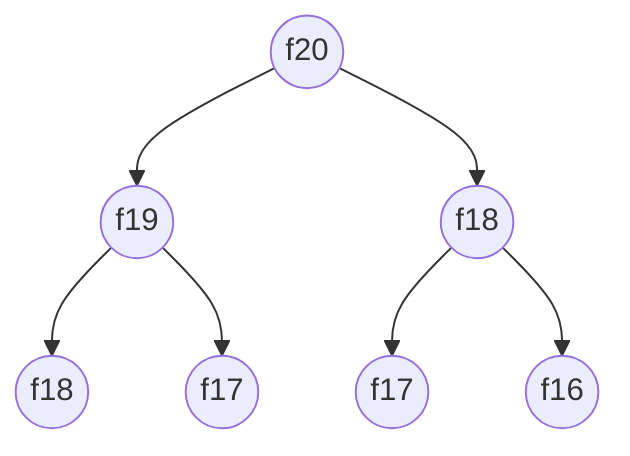

ch01_核心技巧篇
===

###### tags: `leetcode` `python`

<!-- html comment -->

<style>
/* css comment */
/* color */
span[data-color="red"] {
  color: red;
}
span[data-color="orange"] {
  color: #FFA500;
}
span[data-color="cyan"] {
  color: #7DF1C2;
}
/* font size */   
p {
  /* color: #7DF1C2; */
  font-size: 14px;
  text-align: left;
    
  /* background-color: lightblue;
  width: 600px;
  height: 300px;
  overflow: auto !important;
  display:inline-block;
  white-space: pre-wrap; */ /* for multiline */  
}
/* font alignment */       
span[align="left"]
/* table */  
pre {
  overflow-x: auto !important;
}
/*
span[table-wrapper] {
  overflow-y: scroll;
}
    
pre {
  overflow-x: auto !important;
  overflow-y: auto !important;
}
*/
</style>

---


# 目錄

# Chapter01 核心技巧篇

- [1.1 學習演算法和刷題的概念框架](#11-學習演算法和刷題的概念框架)
    - [1.1.1 資料結構的儲存方式](#111-資料結構的儲存方式)
    - [1.1.2 資料結構的基本操作](#112-資料結構的基本操作)
    - 1.1.3 演算法刷題指南
    - 1.1.4 最後總結
- [1.2 動態規劃解題範本框架](#12-動態規劃解題範本框架)
    - 1.2.1 費波那契數列（費氏數列）
    - 1.2.2 湊零錢問題
    - 1.2.3 最後總結
- 1.3 回溯演算法解題範本框桇
    - 1.3.1 全排列問題
    - 1.3.2 N皇后問題
    - 1.3.3 最後總結
- 1.4 BFS 演算法範本框架
    - 1.4.1 演算法框架
    - 1.4.2 二元樹的最小高度
    - 1.4.3 解開密碼鎖的最少次數
- [1.5 雙指標技巧範本框架](#15-雙指標技巧範本框架)
    - 1.5.1 快、慢指標的常用演算法
    - 1.5.2 左、右指標的常用演算法

<br/>
<div align="right">
    <b><a href="#chapter01-核心技巧篇">⬆️ Back to Top</a></b>
</div>
<br/>

---

## 1.1 學習演算法和刷題的概念框架

### 1.1.1 資料結構的儲存方式

資料結構的底層儲存方式只有兩種

1. Array 陣列: 循序儲存
2. Linked List 鏈結串列: 鏈式儲存

其他如 佇列 堆疊 雜湊表 堆積 樹 圖 都可以從這兩種基本資料結構衍生


### <span data-color="cyan">Array vs Linked List</span>

<div style="height:500px;overflow:auto;font-size: 20px;">
    
| <span style="display: inline-block; width:300px">data structure</span> |                                                                        array                                                                        |                                linked list                                 |
|:-----------------------------------------------------------------------|:---------------------------------------------------------------------------------------------------------------------------------------------------:|:--------------------------------------------------------------------------:|
| 儲存方式                                                                   |                                                        <span data-color="red">緊湊連續儲存</span>                                                         |             <span data-color="cyan">元素不連續，依靠指標指向下一個元素位置</span>             |
| 儲存方式 pros                                                              |                                           <span data-color="red">允許隨機存取，透過 index 快速找到元素 -> 節省儲存空間</span>                                            |   <span data-color="cyan">擴容方便，只需知道某一元素的前後驅，即可新增或刪除元素，時間複雜度 O(1)</span>    |
| 儲存方式 cons                                                              |                   <span data-color="red">記憶體空間需一次配足 -> 擴容時需重新分配一塊更大的空間再把資料複製過去 & 插入和刪除元素時每次都要搬移後面所有資料以保持資料連續，時間複雜度皆為 O(n)</span>                    | <span data-color="cyan">儲存空間不連續->不能隨機存取 & 每個元素需多儲存指向前後元素的指標，需較多儲存空間</span> |
| 比喻                                                                     | <span data-color="red">像在酒吧吧台大家排排坐，有新朋友坐進來時所有人都要移位子(Let's try scooching) & 如果要續攤首先要找坐得下這麼多人的空間再整團人過去(記憶體空間需一次配足，擴容時需重新分配一塊更大的空間)，時間複雜度 O(n)；</span> | <span data-color="cyan">儲存空間不連續->不能隨機存取 & 每個元素需多儲存指向前後元素的指標，需較多儲存空間</span> |
      
</div>


### 1.1.2 資料結構的基本操作

巡訪 & 存取: 增 刪 查 改
- 線性
- 非線性 (e.g. binary tree 二元樹巡訪)

觀察 binary tree 二元樹的遞迴巡訪，以及 linked list 的遞迴巡訪，是否相似！

而 N 元樹 的巡訪又可以擴展為圖的巡訪；圖會出現「環」的話只要用 boolean array 標記 visited 就好了

大部分常考的演算法本質都是樹的巡訪，所以先從二元樹下手吧！
> notes. 只要涉及遞迴，通常都是樹的問題
> e.g. 動態規劃 - 湊零錢 -> 就可以想成尋訪一顆 N 元樹（在扣掉現有所有可湊的零錢之後，剩餘的金額當作樹的分支，一路到底）

[linked list traversal (check method 1 and 2)](https://www.geeksforgeeks.org/python-program-to-find-middle-of-a-linked-list-using-one-traversal/)

[binary tree traversal](https://www.tutorialspoint.com/python_data_structure/python_tree_traversal_algorithms.htm)

- [BFS vs DFS for Binary Tree](https://www.geeksforgeeks.org/bfs-vs-dfs-binary-tree/); [二元樹走訪Binary Tree Traversal](https://ithelp.ithome.com.tw/articles/10271647)
  - [Breadth First Traversal (Or Level Order Traversal)](https://www.geeksforgeeks.org/level-order-tree-traversal/) - 層序走訪： 順序是由根節點一層一層往下，由左往右
  - [Depth First Traversals](https://www.geeksforgeeks.org/618/)
    - <span data-color="cyan">Pre-order Traversal (Root-Left-Right) - 前序走訪： 順序是根節點、左子節點、右子節點</span>
    - <span data-color="cyan">In-order Traversal (Left-Root-Right) - 中序走訪： 順序是左子節點、根節點、右子節點</span>
    - <span data-color="cyan">Post-order Traversal (Left-Right-Root) - 後序走訪： 順序是左子節點、右子節點、根節點</span>

[binary tree traversal - figures](https://algodaily.com/challenges/binary-tree-inorder-traversal)

- notice the position of "Node", it relates to the naming


| Pre-order Traversal | In-order Traversal |Post-order Traversal|
|:-----------------------------------------------------------------|:-----------------:|:---------------------------------------------------------------------------------------------------------------------------:|
|||  |
    

1. 前序走訪： 順序是根節點、左子節點、右子節點。
[1, 2, 4, 8, 9, 5, 3, 6, 10, 11, 7]

2. 中序走訪： 順序是左子節點、根節點、右子節點。
[8, 4, 9, 2, 5, 1, 10, 6, 11, 3, 7]

3. 後序走訪歷： 順序是左子節點、右子節點、根節點。
[8, 9, 4, 5, 2, 10, 11, 6, 7, 3, 1]

4. 層序走訪： 順序是由根節點一層一層往下，由左往右。
[1, 2, 3, 4, 5, 6, 7, 8, 9, 10, 11]

----

## 1.2 動態規劃解題範本框架

動態規劃問題具有「最佳子結構」，因此子問題之間互相獨立

> 凡是遇到「遞迴」需要解決的問題(想到「二元樹」) -> 最好都畫出遞迴樹，以利分析複雜度

#### 動態規劃(Dynamic Programming) 一般都是**求極值**
> e.g. 「最長」遞增子序列、「最小」編輯距離

- <p style="color:#7DF1C2">求解動態規劃的核心：列舉</p> -> 再追求聰明的列舉（透過以下的優化方法）
- 動態規劃這類問題<p style="color:#7DF1C2">存在「重疊子問題」</p>
- 只要寫出正確的<p style="color:#7DF1C2">「狀態轉移方程」</p>就好（同時也是最困難的步驟）：狀態，選擇，dp陣列
>  - 這個問題的 base case (最簡單狀況)是？
>  - 有什麼「狀態」？
>  - 每個「狀態」可以做出什麼「選擇」，使得狀態改變？
>  - 如何定義 dp陣列/函數
- <p style="color:#7DF1C2">接下來優化無非是「備忘錄」或「DP table」</p> 只要寫出暴力解（即「狀態轉移方程」），最佳化方法就上述兩種，再無奧妙可言！ 
- <p style="color:#7DF1C2">「備忘錄」再更優化就是「狀態壓縮」：盡可能縮小備忘錄所需記錄的內容．以費氏數列來說就是只儲存最終會用到的前兩個狀態，而不需儲存歷來所有狀態</p>


#### 以[湊零錢 coin change](https://leetcode.com/problems/coin-change/)為例
1. base case
>  - 目標金額 `amount = 0` 時不需任何硬幣，就能湊出目標金額
2. 「狀態」: 也就是<p style="color:#7DF1C2">原問題和子問題的**變數**</p>
>  - 由於硬幣數量無限，硬幣面額也由題目給定；只有目標金額 `amount` 會不斷朝 base case 逼近，因此唯一的「狀態」即 目標金額 `amount`
3. 「選擇」：也就是<p style="color:#7DF1C2">導致「狀態」產生變化的**行為**</p>
>  - 每選擇一枚硬幣，就會使目標金額 `amount` 減少，因此所有硬幣的面額就是「選擇」
4. 定義 dp函數/陣列
>  - 這邊定義 dp(n) 為：輸入一個目標金額n，返回湊出目標金額n的最少硬幣數量




## 1.5 雙指標技巧範本框架

### 1.5.1 快、慢指標的常用演算法

1. 判斷 linked list 是否有環
2. 已知 linked list 有環，找這個環的起始位置
3. 尋找「無環單向linked list」的中點
4. 尋找「單向linked list」的第k個元素

### 1.5.2 左、右指標的常用演算法

1. 二分搜尋
2. 兩數之和
3. 反轉陣列
4. 滑動視窗演算法


---

# template

----

-------------------------------------------------


## season 3 episode _, topic: _
[other resources]()
[friends lines season 3 episode _]()

----

### <span data-color="red">sentences I couldn't keep up with</span>
```diff
- heard
+ correct
```

----

### <span data-color="cyan">sentences I misunderstood</span>

<div style="height:500px;overflow:auto;font-size: 20px;">
    
| <span style="display: inline-block; width:300px">sentence</span> | misunderstood (x) | correct (o) |
|:-------- |:--------:| :--------:|
| sentence | <span data-color="red">misunderstood</span> | <span data-color="cyan">correct_meaning</span> |
    
</div>

----

### vocabulary / sentence (translation to Chinese is not provided, so that I should recall them to reinforce the memory)

<div style="height:500px;overflow:auto;font-size: 20px;">

| <span style="display: inline-block; width:300px">sentence</span> |
|:-------- |

</div>

-------------------------------------------------